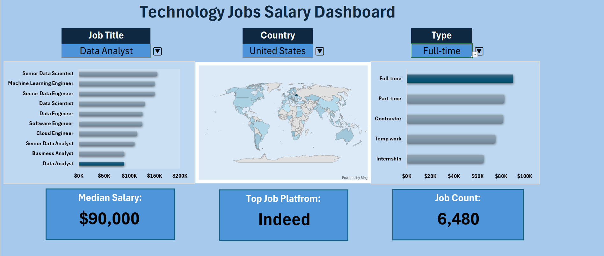
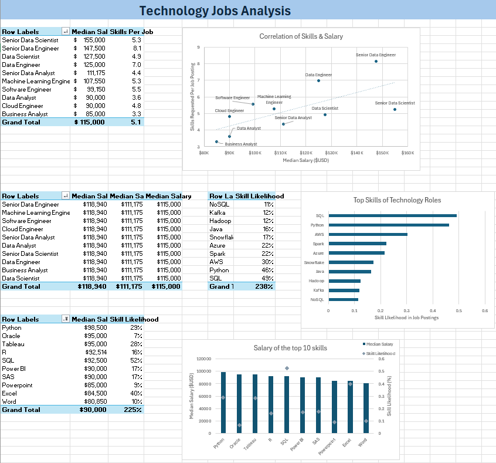

# Technology Jobs Salary Dashboard

An Excel project analyzing salary and skill trends across technology job roles — built as part of my hands-on Excel learning (pivot tables, pivot charts, and dashboard design).

## Overview

This project pulls together technology job postings to answer a simple question: **what skills correlate with higher salaries, and how does that vary by role, country, and job type?**

It's built entirely in Excel using pivot tables, pivot charts, and slicers, with an interactive dashboard on top.

## Dashboard

The dashboard lets you filter by:
- **Job Title** (e.g. Data Analyst, Senior Data Engineer, Machine Learning Engineer)
- **Country**
- **Type** (Full-time, Part-time, Contractor, Temp work, Internship)

And instantly updates:
- Median salary by role
- A world map of postings by country
- Job count and top job platform

## Analysis

Key questions this analysis answers:

1. **Do more in-demand skills correlate with higher salaries?**
   A scatter plot of median salary vs. skills requested per posting shows a positive relationship — roles like Senior Data Engineer and Senior Data Scientist ask for more skills and pay more.

2. **Which skills show up most often in job postings?**
   SQL and Python top the list, followed by AWS, Spark, and Azure.

3. **Which specific skills pay the most, and how common are they?**
   Python and Tableau combine high salary with strong demand; Oracle pays well but appears less frequently.

## Key Findings

- **Highest median salary:** Senior Data Scientist ($155,000)
- **Most requested skill:** SQL (appears in ~49% of postings)
- **Most valuable combination:** Python — high salary ($98,500) and high demand (29% of postings)
- **Overall median salary across all roles:** $115,000

## Tools & Techniques Used

- Pivot Tables & Pivot Charts
- Slicers for interactive filtering
- Conditional formatting
- VLOOKUP / data joins
- Correlation analysis
- Dashboard design (Excel Analysis ToolPak)

## Files

| File | Description |
|---|---|
| `Salary-Dashboard.xlsx` | Full workbook — raw data, pivot tables, and dashboard |
| `images/` | Dashboard and analysis screenshots |
| `notes/excel-notes.md` | My cleaned-up Excel learning notes (functions, formulas, pivot tables, VBA, etc.) |

## Background

This project came out of self-teaching Excel — functions and formulas, conditional formatting, data validation, and pivot tables/charts. My full notes from that process are included in `notes/excel-notes.md` for reference.

## License

Feel free to use this as a reference for your own Excel dashboard projects.
